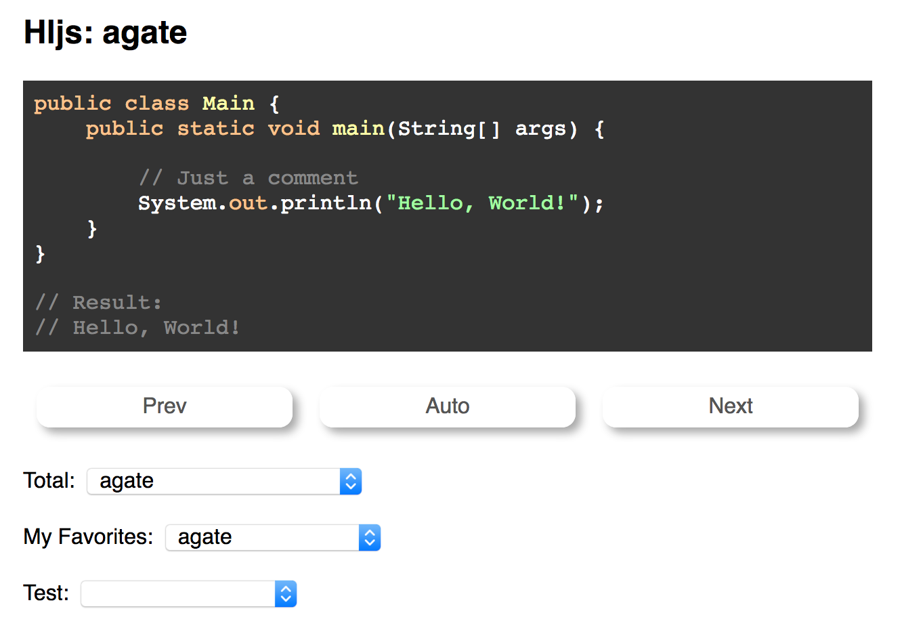
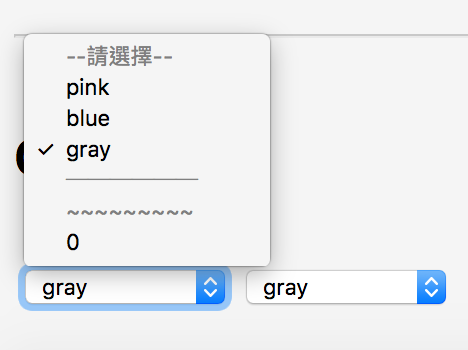

# style-select
Style-Select is a JavaScript library based on [Vue.js](https://github.com/vuejs/vue). You can switch themes using a simple API or HTML `<select>` element. This is ideal for highly customized pages, giving users the choice of style.

Conversely, if your page's style stays the same for long, this may not be what you want.

---

## Demo

[Highlight.js](https://github.com/isagalaev/highlight.js) is my favorite syntax highlighter, it has many themes to choose from.
However, the style I like doesn't mean that other users will also like it.

> So, why not let them make their own choices?

Style-Select makes things easy:


<br>

HTTP(s) requests are sent only when new styles are selected, rather than redundant prefetch.
Of course, it can be used not only for Highlight.js but **for any styles**.

See more demos [here](https://js-zheng.github.io/style-select/demo/).

---

## Install


### HTML
Before everything starts, you have to **load [Vue.js](https://github.com/vuejs/vue) first**!  
Style-Select treats Vue as peer dependency and doesn't bundle it to prevent redundant loading.

```html
<html>
<head>
  ...
  <script src="https://cdn.jsdelivr.net/npm/vue"></script>
  <script src="https://cdn.jsdelivr.net/npm/style-select"></script>
  ...
<head>
```
 
### NPM
```
npm install style-select
```


Once you have installed it, you can use the following simple APIs.

---

## Getting Started

### Style Group

The main concept of Style-Select is to create a **style group**:

```javascript
var yourStyleGroup = StyleSelect.createStyleGroup('groupId');
```

This is purely a container and will **not** cause any **page render**. 

In fact, StyleGroup is just a vue instance, so you can still mount it on any HTML element (optional). This will be useful for external access to information, such `currentStyleName`, `cssPrefix`, `stylesList`, ..., cookieOptions.
```javascript
yourStyleGroup.$mount(domElement or domSelector)
```

Detail Usage:
```javascript
// @returns a vue instance
function createStyleGroup (groupId, hintText = '--please choose--', cssPrefix = 'style-select', supportNoneStyle = true)
```
<br>

### Add Styles

Once the StyleGroup is created, you can start adding styles to it.

```javascript
/**
 * @param baseUrl -- the base url of styles
 * @param styleNames -- {Array}
 * @param supportMinCss -- If the file extension exists `.min`, it must be set to true
 * 
 * @returns true if styles are added successfully.
 */
yourStyleGroup.addStyles('https://cdnjs.cloudflare.com/ajax/libs/highlight.js/9.12.0/styles/',
  ['agate', 'dracula', 'vs2015'], true);
```
<br>

### Default Style

If `groupId` is not null when you're creating a StyleGroup. Each time you switch the style, the records will be automatically saved. The next time you revisit the page, the record of style will be automatically applied.

However, when the first time it is loaded, no style is loaded which may make the page look bad.  This problem can be solved by using **default style**:

```javascript
yourStyleGroup.setDefaultStyle(baseUrl, name, supportMinCss);
```
It should be noted that, unlike `addStyles`, the second parameter (i.e., name) needs to be put into a **string**.

<br>

### StyleSelect

Finally, you can use StyleGroup to make some HTML `<select>` elements without worrying about the state management between them.

```javascript
/**
 * @param el -- the element which will be mounted.
 */
var select = yourStyleGroup.createSelect("#elementId");

var select2 = yourStyleGroup.createSelect(domElement);
```

Even you can add some private styles, text or separator to each menu:



```javascript
select.addStyles('', ['pink', 'blue'], false);

select.addText('~~~~~~~~~');

select.addSeparator();
```

The most important thing is they still have a shared styles which maintained by StyleGroup.  
  
This also represents that above function (i.e., `addText`, `addSeparator`), StyleGroup instance can be used too.
